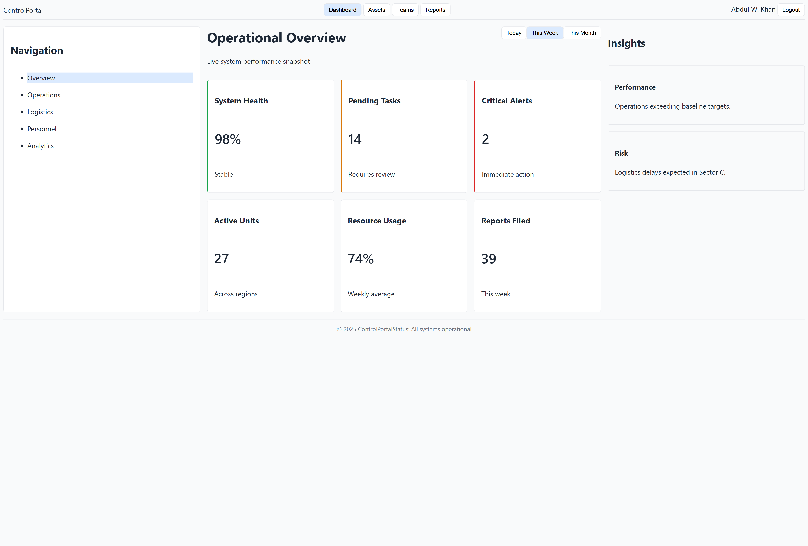

# Control Portal — CSS FORGE

An enterprise-style internal operations dashboard built using **HTML and vanilla CSS**, focused on mastering layout, spacing, and state handling without JavaScript or frameworks.

🌐 **Live Demo:**  
[https://<your-username>.github.io/forge-css-control-portal/](https://waheedkhan10001.github.io/operations-control-dashboard/)

---

## What This Project Demonstrates

- CSS Grid for structural page layout
- Flexbox for alignment and distribution
- Parent-owned spacing using `gap`
- Predictable box model with `border-box`
- State styling (`:hover`, `.active`)
- Quantity-safe layouts (cards can be added/removed safely)

---

## Project Structure

forge-css-control-portal/
├── index.html
├── style.css
├── screenshot.png
├── LICENSE
└── README.md

---

## Tech Stack

- HTML5
- Vanilla CSS (no JavaScript, no frameworks)

---

## Notes

This is a **CSS FORGE** project built for deep internal mastery and correctness.  
A simplified **SHOWCASE version** may be created later for portfolio presentation.

---

## License

MIT License — see the [LICENSE](./LICENSE) file for details.
